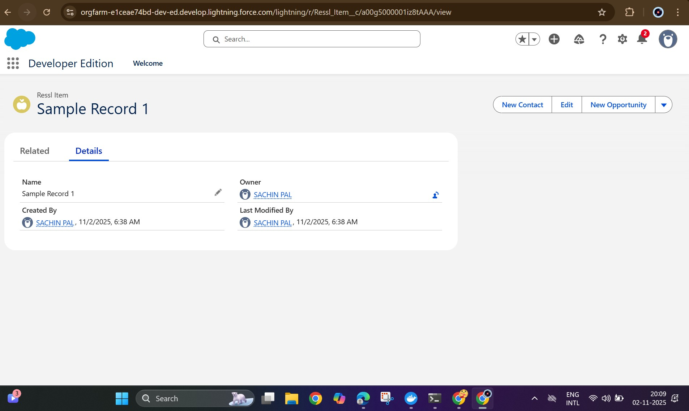

# Salesforce Setup — RESSL Assignment (Task 1)

## Overview
This repository contains the evidence and brief steps for Task 1 of the RESSL assignment: creating a custom object, adding it as a tab, and creating a sample record in Salesforce Developer Edition.

---

## Steps performed (step-by-step)

1. Signed up for a **Salesforce Developer Edition** account at https://developer.salesforce.com.
2. Opened **Setup** → **Object Manager**.
3. Created a new **Custom Object**:
   - **Label:** `Ressl Item`
   - **Plural Label:** `Ressl Items`
   - **Object Name (API):** `Ressl_Item__c`
   - **Record Name:** `Name` (Text)
   - Enabled: Allow Reports, Allow Activities, Allow Search (as needed)
   - Set **Deployment Status** to **Deployed**.
4. Added related fields (optional) such as `Description`, `Status` (Picklist), and `Due Date`.
5. Launched the **New Custom Tab Wizard** and created a **Custom Tab** for `Ressl Item`.
6. Added the tab to the desired App via **App Manager** (so the tab appears in the app navigation).
7. Created a **sample record** via the `Ressl Items` tab:
   - **Name:** `Sample Record 1`
   - **Description:** `This is a demo record for Ressl Assignment.`
   - **Status:** `New` (if picklist added)
8. Verified the record appears in record page, list views, and search results.

---

## Screenshot

## Screenshot

---

## Notes & Assumptions
- I used a Salesforce **Developer Edition** org for this task.
- The example object in this repo is named **Ressl Item** (API: `Ressl_Item__c`).
- Screenshots are included to show the object details, the tab, and the created record.

---

## Author
**Sachin Pal**  
